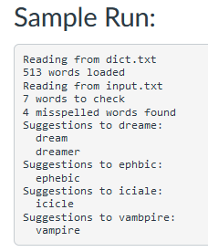

# COP5417_Proj3
 

## Overview:

Create a Java spell checker program using a custom-built externally-chained hash table to efficiently identify and suggest corrections for misspelled words. The program will read words from an input file, hash them for dictionary lookups, and generate suggestions by assuming one letter missing, one letter added, or one letter changed. This practical exercise enhances students' understanding of hash tables and strengthens their proficiency in Java programming.

## Learning Objectives:

Hash Tables: Understanding the concept of hash tables and their efficient data retrieval, using a custom-built externally-chained hash table for dictionary lookups.
File Handling: Gaining experience in reading files, such as the dictionary file and input file, to process data in the spell checker program.
String Manipulation: Practicing string manipulation techniques to generate suggestions for misspelled words by adding, removing, or swapping letters.

## Project Description:

In this project, you need to implement a hash table class to store words. In this case, our key is the word and we do not need to store any value. It is similar to the Java Set interface. The spell check class should contain a main function and other static method to support the functionality to run the program.

The spell checker program should read the dictionary file and store the words in the hash table of string. The program should then read the input file and check each word against the dictionary. If the word is not found in the dictionary, the program should print the word and its suggestions. The suggestions should be generated by assuming one letter missing, one letter added, or one letter wrong. The program should also print the total number of words in the input file and the number of misspelled words.

You can use a brute force method to create all potential ideas on misspelled words in order to find the suggestions. By putting letters from a to z to each location of the word, removing each letter, and replacing each letter with letters from a to z, you can create possible right words. Next, see if the dictionary has the revised words. If so, include them on the list of suggestions.

## Code Organization
## The Main Class

Provided driver of the whole application.
### The SpellChecker Class

The class that employs the hash table to store the dictionary and check the correctness of words in the input file.

The loadDictionary method: Loads the dictionary file and stores the words in the hash table. The dictionary file is a text file that contains a list of words in each line. Create a hash table with a size of 2000.
The checkWords method: Checks the correctness of words in the input file and prints the misspelled words and their suggestions.

### The HashTable Class

The class that implements the hash table. It should be a simple hash table that stores only the keys.

    The HashTable constructor: Creates a hash table with the given size passed to the constructor.
    The hash method: Hashes the given key. You can use the hashCode method of the String class.
    The put method: adds a key to the hash table.
    The contains method: checks if the hash table contains the given key.
    We do not need delete, size, resize, and isEmpty methods for this project at all.

